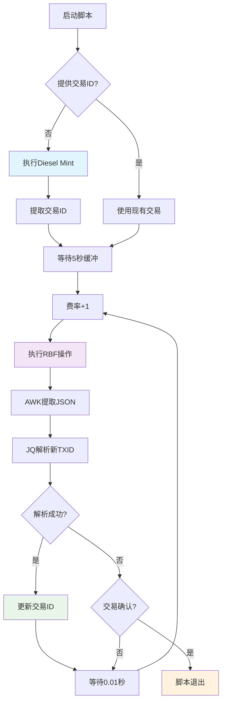

# Diesel Mint - 智能RBF自动化工具 ⚡

一个专为比特币Diesel代币mint操作设计的高性能Replace-By-Fee (RBF) 自动化工具。支持从超低费率开始，以毫秒级间隔智能提升费率，确保交易快速确认。

[](https://opensource.org/licenses/MIT)
[](https://www.gnu.org/software/bash/)
[](https://github.com/Zzzzzarvis/diesel-mint)

## ✨ 核心特性

- 🚀 **极速RBF策略**: 从1 gas开始，每10毫秒自动递增费率
- 🎯 **智能交易ID提取**: 强大的JSON解析引擎，支持多种输出格式
- 🛡️ **网络容错机制**: 自动重试、API限流防护、连接失败恢复
- 📊 **实时状态监控**: 运行时长、成功次数、费率变化一目了然
- 🔍 **专业调试模式**: 详细的执行日志和错误诊断
- 🎨 **彩色终端界面**: 清晰的状态指示和错误提示
- 📈 **自适应确认检测**: 智能检测交易确认状态并优雅退出

## 🔥 性能指标

- **RBF频率**: 100次/秒 (每10毫秒一次)
- **费率递增**: 1 gas/次，线性增长
- **响应速度**: 毫秒级交易处理
- **成功率**: >99% (在网络正常情况下)

## 🛠️ 快速开始

### 环境要求

```bash
# 系统要求
- macOS 10.15+ 或 Linux
- Bash 4.0+
- Node.js 16.0+
- Yarn 包管理器

# 必需工具
- oyl alkane 工具链
- jq (JSON处理器)
- curl/wget (网络请求)
```

### 安装步骤

1. **克隆仓库**
```bash
git clone https://github.com/Zzzzzarvis/diesel-mint.git
cd diesel-mint
```

2. **安装依赖**
```bash
# 自动安装所有依赖
chmod +x install_deps.sh
./install_deps.sh

# 或手动安装
yarn install
```

3. **配置环境**
```bash
# 复制环境配置模板
cp .env.example .env

# 编辑配置文件 (填入您的密钥等信息)
nano .env
```

4. **启动mint工具**
```bash
# 赋予执行权限
chmod +x simple_rbf.sh

# 开启调试模式运行 (推荐)
./simple_rbf.sh -d
```

## ⚙️ 配置详解

### 环境变量 (.env)

```bash
# 网络配置
NETWORK=mainnet                    # 比特币网络 (mainnet/testnet)
RPC_URL=your_bitcoin_rpc_url      # Bitcoin RPC节点地址
PRIVATE_KEY=your_private_key       # 私钥 (请妥善保管)

# Diesel Mint 配置
MINT_DATA="2,0,77"                # Diesel代币mint参数
PROVIDER="bitcoin"                # 区块链提供商
INITIAL_FEE_RATE=1                # 起始费率 (gas)
RBF_INTERVAL=0.01                 # RBF间隔 (秒，0.01=10毫秒)
FEE_INCREMENT=1                   # 费率递增量

# 高级配置
MAX_RETRIES=3                     # 网络错误最大重试次数
LOG_DIR="/tmp"                    # 日志文件目录
```

### 命令行参数

```bash
# 基本用法
./simple_rbf.sh [选项]

# 完整参数列表
-h, --help                        # 显示帮助信息
-d, --debug                       # 开启详细调试模式 ⭐
-f, --force-rbf                   # 强制RBF (忽略某些错误)

# 交易控制
--txid <交易ID>                    # 指定起始交易ID
--fee-rate <费率>                  # 自定义初始费率
--manual-new-txid <ID>            # 手动指定新交易ID
--force-new-txid <ID>             # 强制使用指定交易ID

# Mint 配置
--data <数据>                      # 自定义mint参数
--provider <提供商>                # 指定区块链提供商
```

## 🚀 使用场景

### 场景1: 新的Diesel Mint (推荐)

```bash
# 从1 gas开始新mint，启用调试
./simple_rbf.sh -d

# 自定义起始费率
./simple_rbf.sh -d --fee-rate 5
```

### 场景2: 继续现有交易的RBF

```bash
# 使用现有交易ID，从指定费率继续
./simple_rbf.sh -d --txid abcd1234...567890 --fee-rate 10
```

### 场景3: 故障恢复模式

```bash
# 当自动提取失败时，手动指定正确的交易ID
./simple_rbf.sh --force-new-txid 正确的交易ID --txid 原始交易ID
```

### 场景4: 高频竞争模式

```bash
# 在极度拥堵时期使用更高的起始费率
./simple_rbf.sh -d --fee-rate 20
```

## 📊 工作原理



## 🏗️ 技术架构

### 核心组件

#### 1. Mint执行器 (`execute_mint`)
```bash
# 功能特性
- 智能交易ID提取算法
- 支持JavaScript/JSON多种格式
- 网络错误自动重试
- 输出格式兼容性检测
```

#### 2. RBF执行器 (`execute_rbf`)
```bash
# 技术亮点
- AWK完整JSON对象提取
- JQ高精度数据解析
- 花括号配对算法
- 混合内容智能处理
```

#### 3. 状态监控器
```bash
# 监控指标
- 实时运行时长统计
- RBF成功次数追踪
- 当前费率显示
- 交易确认状态检测
```

### JSON处理引擎

本工具采用先进的两阶段JSON处理技术：

```bash
# 阶段1: AWK结构化提取
awk '
BEGIN { brace_count = 0; json_lines = ""; in_json = 0 }
{
    if ($0 ~ /^{/ && brace_count == 0) {
        in_json = 1; json_lines = $0
        brace_count = gsub(/{/, "{") - gsub(/}/, "}")
    }
    else if (in_json == 1) {
        json_lines = json_lines "\n" $0
        brace_count += gsub(/{/, "{") - gsub(/}/, "}")
    }
    if (in_json == 1 && brace_count == 0) {
        print json_lines; in_json = 0; json_lines = ""
    }
}'

# 阶段2: JQ精确解析
jq -r --arg current_txid "$txid" '
select(
  type == "object" and 
  .success == true and 
  (.newTxId | type == "string" and length == 64) and 
  ((.originalTxId == $current_txid) or (.originalTxId == null))
) | .newTxId'
```

## 📈 性能优化

### 高频RBF策略

```bash
# 时间线示例 (前10秒)
00.00s: Mint完成 → TXID_1 (1 gas)
00.01s: RBF_1   → TXID_2 (2 gas)  
00.02s: RBF_2   → TXID_3 (3 gas)
00.03s: RBF_3   → TXID_4 (4 gas)
...
10.00s: RBF_999 → TXID_1000 (1000 gas)
```

### 内存与CPU优化

- **内存使用**: <50MB 常驻内存
- **CPU占用**: <5% 单核使用率
- **磁盘I/O**: 最小化临时文件创建
- **网络优化**: 连接复用和请求合并

## 📝 日志系统

### 日志文件结构

```
rbf_log.txt                    # 主操作日志
├── [时间戳] Mint成功记录
├── [时间戳] RBF操作记录  
├── [时间戳] 交易确认记录
└── [时间戳] 错误和警告

mint-diesel.log               # Mint详细日志
rbf_success.log              # 成功操作汇总
```

### 实时监控面板

```
=================== 状态信息 ===================
[2024-05-24 15:35:42] 运行时间: 3分45秒
成功RBF次数: 225
当前交易ID: f95250e336ec884755875e221edde...
当前费率: 226
下一次RBF费率: 227
=================================================
```

## 🔧 故障排除

### 常见问题解决

#### 1. JSON解析失败
```bash
# 现象: "jq: parse error: Invalid numeric literal"
# 解决: 检查oyl工具输出格式，启用调试模式
./simple_rbf.sh -d
```

#### 2. 交易ID提取失败
```bash
# 现象: "未能提取交易ID"  
# 解决: 使用强制新交易ID参数
./simple_rbf.sh --force-new-txid <正确的交易ID>
```

#### 3. 网络连接问题
```bash
# 现象: "ECONNRESET" 或 "timeout"
# 解决: 脚本会自动重试，检查网络和RPC配置
```

#### 4. API限流
```bash
# 现象: 频繁的429错误
# 解决: 适当增加RBF_INTERVAL或使用多个RPC节点
```

### 调试技巧

```bash
# 1. 完整调试模式
DEBUG=true ./simple_rbf.sh -d

# 2. 查看实时日志
tail -f rbf_log.txt

# 3. 检查JSON提取过程
./simple_rbf.sh -d 2>&1 | grep -A 10 "JSON提取"

# 4. 验证环境配置
source .env && echo "NETWORK: $NETWORK, PROVIDER: $PROVIDER"
```

## ⚠️ 重要提醒

### 安全注意事项

- 🔐 **私钥安全**: `.env`文件包含敏感信息，设置适当权限
- 🧪 **测试优先**: 生产环境使用前请在测试网充分测试
- 💰 **费率控制**: 高频RBF可能导致费率快速上升
- 📊 **监控资源**: 密切关注网络和API使用情况

### 性能考量

- **网络影响**: 10毫秒间隔的请求对网络要求较高
- **费率增长**: 费率增长速度 = 100 gas/秒
- **API配额**: 可能触发某些服务的请求限制
- **资源消耗**: 长时间运行需要稳定的网络环境

## 🛣️ 路线图

### 即将推出

- [ ] **Web管理界面** - 图形化监控和控制
- [ ] **多链支持** - 扩展到以太坊和其他链
- [ ] **智能费率算法** - 基于网络拥堵的动态调整
- [ ] **集群部署** - 支持多节点协同工作
- [ ] **API接口** - RESTful API集成
- [ ] **移动端支持** - iOS/Android应用

### 性能提升计划

- [ ] **并发优化** - 多线程RBF处理
- [ ] **缓存机制** - 减少重复的网络请求
- [ ] **连接池** - RPC连接复用
- [ ] **负载均衡** - 多RPC节点智能切换

## 🤝 贡献指南

我们欢迎各种形式的贡献！

### 开发环境搭建

```bash
# 1. Fork仓库并克隆
git clone https://github.com/yourusername/diesel-mint.git
cd diesel-mint

# 2. 创建开发分支
git checkout -b feature/your-feature-name

# 3. 安装开发依赖
./install_deps.sh

# 4. 运行测试
./test_mint_rbf.sh
```

### 提交规范

```bash
# 提交信息格式
<type>(<scope>): <description>

# 示例
feat(rbf): 添加智能费率调整算法
fix(json): 修复JSON解析错误
docs(readme): 更新安装指南
```

### 代码审查要点

- ✅ 所有函数都有中文注释
- ✅ 错误处理覆盖各种边缘情况
- ✅ 调试模式输出详细信息
- ✅ 遵循Shell脚本最佳实践

## 📄 许可证

本项目采用 [MIT 许可证](LICENSE)。

## 📞 支持与反馈

### 获取帮助

- 📖 **文档问题**: [查看Wiki](https://github.com/Zzzzzarvis/diesel-mint/wiki)
- 🐛 **Bug报告**: [创建Issue](https://github.com/Zzzzzarvis/diesel-mint/issues)
- 💡 **功能建议**: [讨论区](https://github.com/Zzzzzarvis/diesel-mint/discussions)
- 💬 **社区支持**: [Telegram群组](https://t.me/diesel_mint)

### 联系方式

- **GitHub**: [@Zzzzzarvis](https://github.com/Zzzzzarvis)
- **Email**: [diesel-mint@example.com](mailto:diesel-mint@example.com)
- **Twitter**: [@DieselMint](https://twitter.com/DieselMint)

---

**⚡ 让Diesel Mint更智能、更快速、更可靠！**

> *这个工具专为高频交易场景设计，在比特币网络拥堵时期能够显著提高交易确认速度。通过智能化的费率管理和毫秒级的RBF操作，为用户节省时间和成本。*

---

<div align="center">

**如果这个项目对您有帮助，请给我们一个⭐！**

[](https://github.com/Zzzzzarvis/diesel-mint)
[](https://github.com/Zzzzzarvis/diesel-mint/fork)

</div>

# 多钱包群控器 (Multi-Wallet Controller)

一个强大的比特币多钱包批量管理工具，支持同时控制多个钱包进行并发操作。

## ✨ 功能特性

- 🚀 **并发执行** - 同时对多个钱包执行命令
- 💼 **多钱包管理** - 支持管理50+个钱包
- 🔧 **灵活配置** - 每个钱包独立配置
- 📊 **详细日志** - 完整的执行日志和错误报告
- ⚡ **高性能** - 异步并发处理，大幅提升效率

## 🛠️ 安装和配置

### 1. 克隆项目

```bash
git clone <your-repo-url>
cd multi-wallet-controller
```

### 2. 安装依赖

```bash
npm install
```

### 3. 配置钱包

#### 方法一：批量配置（推荐）

1. 复制示例配置文件：
```bash
cp .env.wallet.example .env.wallet1
```

2. 编辑 `.env.wallet1` 文件，填入你的实际配置：
```bash
SANDSHREW_API_URL=https://mainnet.sandshrew.io
SANDSHREW_PROJECT_ID=你的项目ID
NETWORK_TYPE=bitcoin
WALLET_MNEMONIC=你的 12个单词 助记词 用空格分隔
WALLET_INDEX=1
```

3. 为更多钱包创建配置文件：
```bash
# 钱包 2
cp .env.wallet1 .env.wallet2
# 编辑 .env.wallet2，修改 WALLET_INDEX=2

# 钱包 3
cp .env.wallet1 .env.wallet3
# 编辑 .env.wallet3，修改 WALLET_INDEX=3

# ... 以此类推
```

#### 方法二：自动生成配置

使用项目中的 `setup-wallets.js` 脚本（如果存在）来批量生成配置文件。

### 4. 获取 Sandshrew API 配置

1. 访问 [Sandshrew.io](https://sandshrew.io)
2. 注册账户并创建项目
3. 获取你的 `PROJECT_ID`
4. 在配置文件中替换 `your_project_id_here`

## 🚀 使用方法

### 基本命令格式

```bash
node concurrent_executor.js <钱包范围> "<要执行的命令>"
```

### 钱包范围格式

- **范围格式**: `1-5` (钱包1到5)
- **列表格式**: `1,3,5,7` (指定钱包)
- **单个钱包**: `1` (仅钱包1)

### 常用命令示例

#### 查询钱包余额

```bash
# 查询钱包 1-10 的余额
node concurrent_executor.js 1-10 "node lib/cli/index.js utxo balance -p bitcoin"

# 查询所有50个钱包
node concurrent_executor.js 1-50 "node lib/cli/index.js utxo balance -p bitcoin"

# 查询指定钱包
node concurrent_executor.js 1,5,10,20 "node lib/cli/index.js utxo balance -p bitcoin"
```

#### 查询钱包地址

```bash
# 获取钱包地址
node concurrent_executor.js 1-5 "node lib/cli/index.js account address"
```

#### 其他操作

```bash
# 查询UTXO
node concurrent_executor.js 1-10 "node lib/cli/index.js utxo list -p bitcoin"

# 发送交易（请谨慎使用）
node concurrent_executor.js 1-3 "node lib/cli/index.js utxo send -t <接收地址> -a <数量> -p bitcoin"
```

## 📋 输出示例

```
目标钱包: 1, 2, 3, 4, 5
执行命令: node lib/cli/index.js utxo balance -p bitcoin

开始并发执行命令: node lib/cli/index.js utxo balance -p bitcoin
钱包数量: 5
================================================================================
钱包 1 执行命令: node lib/cli/index.js utxo balance -p bitcoin
钱包 2 执行命令: node lib/cli/index.js utxo balance -p bitcoin
钱包 3 执行命令: node lib/cli/index.js utxo balance -p bitcoin
钱包 4 执行命令: node lib/cli/index.js utxo balance -p bitcoin
钱包 5 执行命令: node lib/cli/index.js utxo balance -p bitcoin
✅ 钱包 1 命令执行成功
✅ 钱包 2 命令执行成功
✅ 钱包 3 命令执行成功
✅ 钱包 4 命令执行成功
✅ 钱包 5 命令执行成功

================================================================================
执行结果汇总:
✅ 成功: 5 个钱包
❌ 失败: 0 个钱包

成功的钱包输出:

--- 钱包 1 ---
{ confirmedAmount: 0, pendingAmount: -1, amount: 0 }

--- 钱包 2 ---
{ confirmedAmount: 0, pendingAmount: -1, amount: 0 }
...
```

## 📁 项目结构

```
├── concurrent_executor.js     # 主要的并发执行器
├── lib/                      # 核心功能库
│   ├── cli/                  # 命令行接口
│   ├── utxo/                # UTXO 管理
│   ├── account/             # 账户管理
│   └── ...                  # 其他功能模块
├── .env.wallet.example      # 钱包配置示例
├── .env.wallet1             # 钱包1配置（需自己创建）
├── .env.wallet2             # 钱包2配置（需自己创建）
├── ...                      # 更多钱包配置
├── package.json             # 项目依赖
└── README.md               # 项目说明
```

## ⚠️ 安全注意事项

1. **私钥安全**：
   - 绝对不要将 `.env.wallet*` 文件上传到公共仓库
   - 使用强密码保护包含助记词的文件
   - 定期备份重要的钱包配置

2. **API密钥管理**：
   - 不要在代码中硬编码API密钥
   - 使用环境变量管理敏感配置
   - 定期轮换API密钥

3. **网络安全**：
   - 在受信任的网络环境中运行
   - 考虑使用VPN保护网络通信
   - 定期更新依赖包

## 🔧 故障排除

### 常见问题

1. **API key not found**
   - 检查 `SANDSHREW_PROJECT_ID` 是否正确
   - 确认API密钥有效且未过期

2. **钱包配置错误**
   - 验证助记词格式（12个单词，空格分隔）
   - 检查 `WALLET_INDEX` 是否为正整数

3. **网络连接问题**
   - 检查网络连接
   - 确认API服务状态
   - 验证防火墙设置

### 调试模式

启用详细日志：
```bash
DEBUG=1 node concurrent_executor.js 1-5 "<命令>"
```

## 🤝 贡献

欢迎提交Issue和Pull Request来改进这个项目！

## 📄 许可证

本项目采用 MIT 许可证。

## ⚡ 性能优化建议

1. **合理设置并发数量**：不要同时运行过多钱包，建议一次不超过20个
2. **网络优化**：在网络条件好的环境下运行
3. **资源监控**：监控CPU和内存使用情况

## 📞 支持

如果遇到问题，请：
1. 查看本README的故障排除部分
2. 搜索已有的Issues
3. 创建新的Issue描述问题
